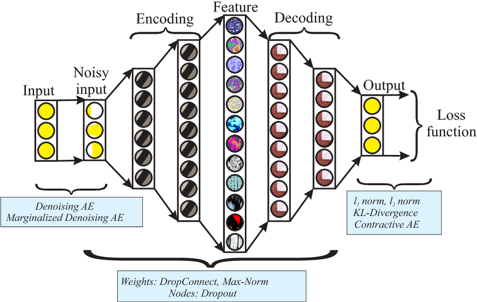

# Sparse Autoencoder Implementation in PyTorch

<p align="center">
  
</p>

## 👨🏽‍💻 Overview
This code implements a basic sparse autoencoder (SAE) in PyTorch. The loss is implemented from scratch; it uses MSE plus a penalty using KL divergence. In this case I used a very basic encoder and decoder architecture. This code is designed to be educational and is not focused on performance.

## 🛠️ Parameters
The parsed arguments allow the architecture to be launched from the terminal.

- batch_size: sets the batch size for training the model.
- n_epochs: sets the number of epochs for training.
- lr: sets the learning rate.
- in_dims: sets input dimensions of the model.
- h_dims: sets hidden dimensions of the model.
- sparsity_lambda: sets the lambda value for the SAE ().
- sparsity_target: sets the sparsity target value ().
- show_summary: show model parameters and summary.
- download_mnist: download MNIST dataset for training.
- train: launch training.

Here's the default values for the code:
```
python3 sae.py \
--batch_size 64 \
--n_epochs 20 \
--lr 0.001 \
--in_dims 784\
--h_dims 1024 \
--sparsity_lambda 1e-4 \
--sparsity_target 0.05 \
--show_summary True \
--download_mnist True \
--train False \
```

## 🚀 Fast Launch
Use this in your terminal to train the SAE model:
```
cd 
python3 sae.py --train True
```